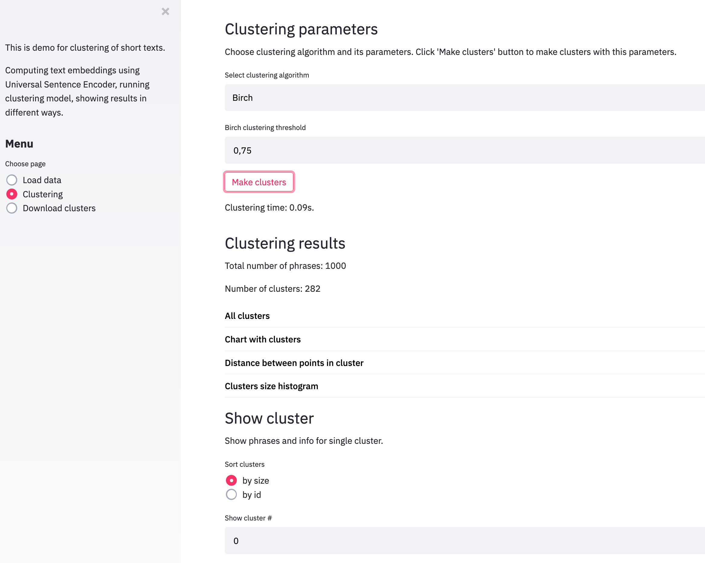

# Streamlit app for clustering of short texts

App for comparing different clustering methods on short texts consisting of one or several sentences. It can help to find appropriate clustering model and illustrates different ways of analyzing clustering results.



Upload csv file with data, choose clustering algorithm and its parameters. Then app will use Universal Sentence Encoder to make text embeddings, run clustering and show results in different ways.

Ways to analyze results:
- Show size of each cluster and corresponding histogram.
- Compute center of each cluster (phrase with minumum average cosine distance to all other phrases in cluster).
- Make dimensionality reduction (t-SNE) and make interactive plot with all cluster centers with size 
of points reflecting cluster size. It helps to quickly look at all clusters.
- Analyze maximum and mean cosine distance between points inside cluster. It helps to understand quality of clusters, how similar are phrases inside clusters.
- Sort clusters by size and show them one by one. Analyze biggest and most important clusters first.


### Usage 

```sh
pip install -r requirements.txt

streamlit run streamlit_app.py
```


